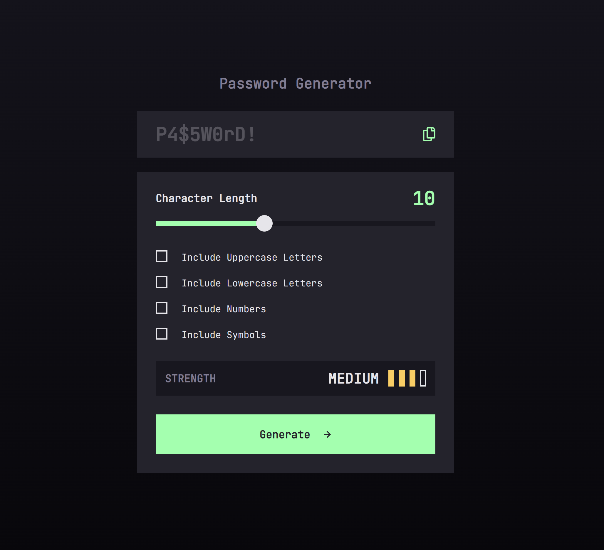

# Frontend Mentor - Password generator app solution

This is a solution to the [Password generator app challenge on Frontend Mentor](https://www.frontendmentor.io/challenges/password-generator-app-Mr8CLycqjh).

## Overview

### The challenge

Users should be able to:

- Generate a password based on the selected inclusion options
- Copy the generated password to the computer's clipboard
- See a strength rating for their generated password
- View the optimal layout for the interface depending on their device's screen size
- See hover and focus states for all interactive elements on the page

### Screenshot

### Links

- Solution URL: [GitHub](https://github.com/ArunBohra12/password-generator)
- Live Site URL: [Live Site](https://arunbohra-password-generator.netlify.app)

## My process

### Built with

- Angular JS
- Typescript
- Tailwind CSS

### What I learned

This was my first time using Angular. A good experience, learned about a totally different approach while creating frontend applications.

## Author

- Website - [Arun Bohra](https://arun-bohra.com)
- Frontend Mentor - [@ArunBohra12](https://www.frontendmentor.io/profile/ArunBohra12)
- Twitter - [@ArunBohra122](https://twitter.com/ArunBohra122)
